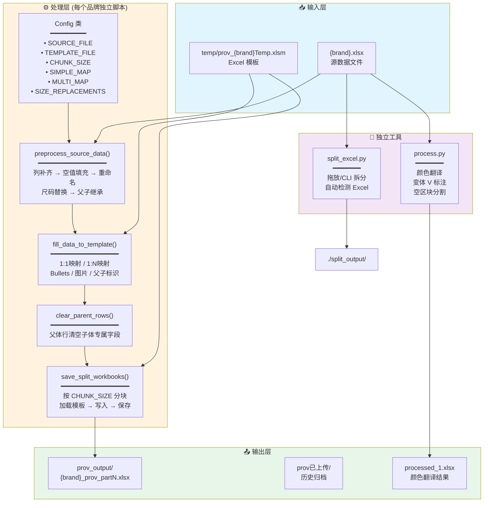
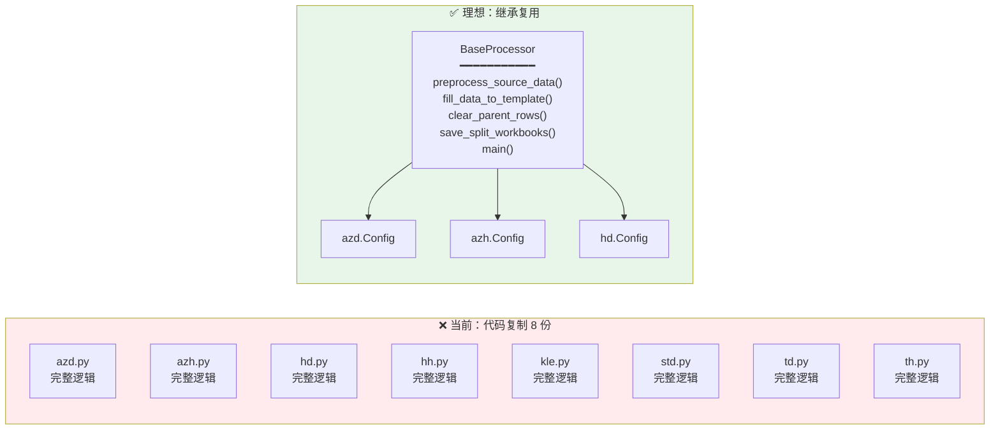
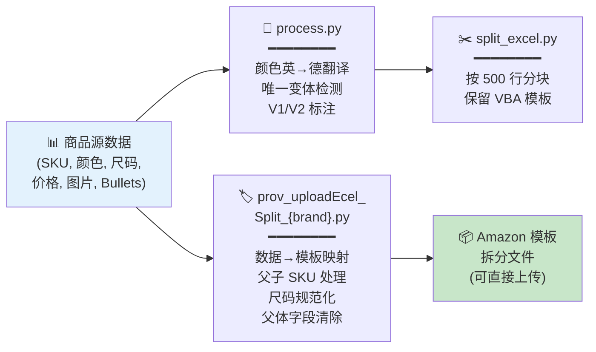
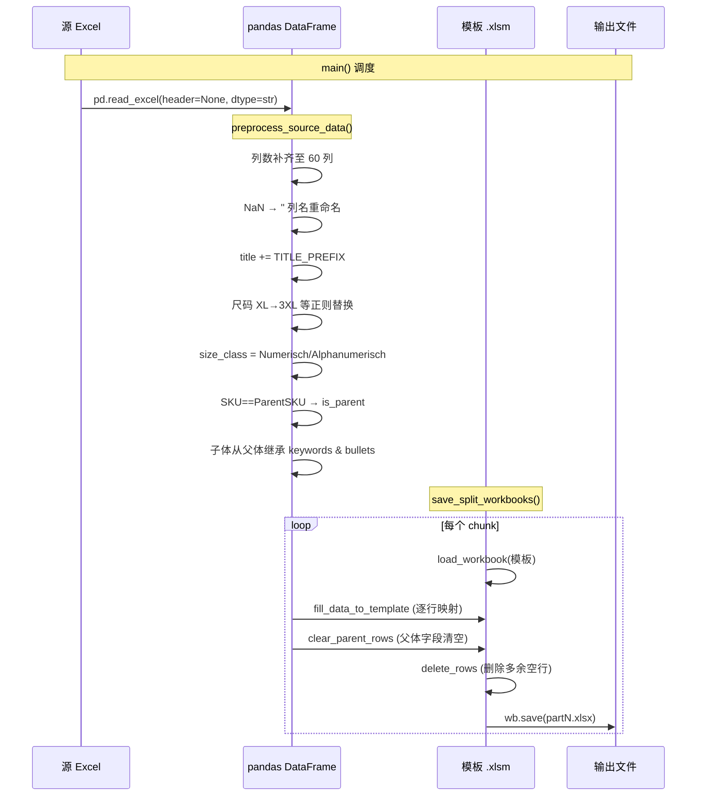

# 项目完整分析报告

> 分析时间：2026-06-12 | 分析范围：全部源代码文件

---

## 1. 项目概览

| 维度 | 详情 |
|------|------|
| **项目名称** | autoUpload — 亚马逊商品数据拆分与上传处理工具集 |
| **核心用途** | 将 Amazon 商品批量数据 Excel 拆分为多个模板文件，包含颜色翻译、尺码标准化、父子 SKU 继承等预处理逻辑 |
| **业务领域** | 跨境电商（Amazon 德国站）Listing 批量上传 |
| **开发语言** | Python 3.x |
| **技术栈** | pandas, openpyxl, PyInstaller |
| **版本管理** | ❌ 无 Git 仓库、无版本号、无 CHANGELOG |
| **打包工具** | PyInstaller (`.spec`) |
| **运行平台** | Windows 10 Pro |

---

## 2. 架构分析

### 2.1 目录结构

```
autoUpload/
├── process.py                        # 颜色翻译与变体标注工具
├── split_excel.py                    # 通用 Excel 拆分工具（拖放支持）
├── prov_uploadEcel_Split_azd.py      # azd 品牌模板处理器
├── prov_uploadEcel_Split_azh.py      # azh 品牌模板处理器
├── prov_uploadEcel_Split_hd.py       # hd 品牌模板处理器
├── prov_uploadEcel_Split_hh.py       # hh 品牌模板处理器
├── prov_uploadEcel_Split_kle.py      # kle 品牌模板处理器
├── prov_uploadEcel_Split_std.py      # std 品牌模板处理器
├── prov_uploadEcel_Split_td.py       # td 品牌模板处理器
├── prov_uploadEcel_Split_th.py       # th 品牌模板处理器
├── build_all.bat                     # PyInstaller 构建脚本
├── 拆分表工具.spec                    # PyInstaller spec 配置
├── md/
│   ├── buffer.md                     # PyInstaller 构建命令备忘
│   ├── mailPrompt.md                 # 亚马逊客服 AI Prompt 模板
│   └── 映射规则.md                    # (空文件)
├── sku.md                            # SKU 列表数据
├── temp/                             # Excel 模板文件夹 (.xlsm/.xlsx)
├── prov_output/                      # 处理输出文件夹
├── prov已上传/                        # 已上传文件归档
├── build/                            # PyInstaller 构建产物
├── dist/                             # 打包 exe 输出
├── 1.xlsx                            # process.py 源文件
├── 610hh.xlsx ~ 612azd.xlsx          # 各品牌源数据文件
└── processed_1.xlsx                  # process.py 输出文件
```

### 2.2 模块划分

```
┌──────────────────────────────────────────────────────┐
│                    工具层                              │
│  process.py         颜色翻译 / 变体标注                │
│  split_excel.py     Excel 拆分（拖放、命令行）         │
├──────────────────────────────────────────────────────┤
│                    品牌处理层                          │
│  prov_uploadEcel_Split_{azd,azh,hd,hh,kle,std,td,th} │
│  → 8 个文件间代码相似度 > 95%，仅 Config 类不同        │
├──────────────────────────────────────────────────────┤
│                    打包部署层                          │
│  build_all.bat / 拆分表工具.spec  PyInstaller 打包     │
├──────────────────────────────────────────────────────┤
│                    配置/数据层                         │
│  md/  sku.md  temp/  (模板、数据、AI Prompt)          │
└──────────────────────────────────────────────────────┘
```

### 2.3 入口文件

| 入口 | 说明 |
|------|------|
| [process.py:203](process.py#L203) | `if __name__ == "__main__"` 颜色翻译工具主入口 |
| [split_excel.py:200](split_excel.py#L200) | `if __name__ == "__main__"` 拆分工具主入口 |
| 8 个 `prov_uploadEcel_Split_*.py` | 每个均可独立运行的品牌处理器 |
| [dist/拆分表工具.exe](dist/) | PyInstaller 打包的可执行文件 |

### 2.4 设计模式

- **Template Method 模式（变体）**：8 个品牌处理文件共享完全相同的处理逻辑（`preprocess_source_data`、`fill_data_to_template`、`clear_parent_rows`、`save_split_workbooks`），仅 Config 类参数不同 —— 但**通过代码复制实现**，而非继承
- **配置驱动**：使用 `Config` 类集中管理列映射、尺码替换、拆分参数
- **流水线模式**：`读取 → 预处理 → 填充 → 清除 → 保存` 线性处理

---

## 3. 依赖清单

### 3.1 核心依赖

| 包名 | 版本 | 用途 | 使用位置 |
|------|------|------|----------|
| **pandas** | 未锁定 | Excel 读取、数据清洗、父子 SKU 继承 | 10 个文件 |
| **openpyxl** | 未锁定 | Excel 模板加载、单元格写入、合并单元格操作 | 9 个文件 |
| **re** | 标准库 | 正则替换（尺码、颜色后缀） | 10 个文件 |
| **math** | 标准库 | 分块数量计算 `math.ceil` | 9 个文件 |
| **argparse** | 标准库 | 命令行参数解析 | [split_excel.py](split_excel.py) |
| **pathlib** | 标准库 | 文件路径操作 | [split_excel.py](split_excel.py) |

### 3.2 构建依赖

| 包名 | 用途 | 文件 |
|------|------|------|
| **PyInstaller** | Python 打包为 .exe | [build_all.bat](build_all.bat), [拆分表工具.spec](拆分表工具.spec) |

### 3.3 版本状态

- ⚠️ **无 `requirements.txt` / `pyproject.toml` / `Pipfile`** — 依赖版本完全浮空
- ⚠️ 无虚拟环境说明
- ⚠️ 无法复现一致的运行环境

---

## 4. 代码质量

### 4.1 类型安全

| 问题 | 严重度 | 说明 |
|------|--------|------|
| 零类型注解 | 🔴 高 | 整个项目没有任何 Type Hints（函数参数、返回值均为无类型） |
| [split_excel.py:36](split_excel.py#L36) 返回类型 `list` | 🟡 中 | 虽返回 `list`，但未指定元素类型 |
| Config 类属性无类型 | 🟡 中 | 大量字典、列表无类型约束 |

### 4.2 代码规范

| 问题 | 严重度 | 详情 |
|------|--------|------|
| **严重代码重复** | 🔴 高 | 8 个 `prov_uploadEcel_Split_*.py` 中，`preprocess_source_data`、`fill_data_to_template`、`clear_parent_rows`、`save_split_workbooks` 4 个函数完全相同（共 ~250 行 × 8 = ~2000 行重复） |
| 注释掉的代码未清理 | 🟡 中 | [prov_uploadEcel_Split_hd.py:45-61](prov_uploadEcel_Split_hd.py#L45-L61) 和 [prov_uploadEcel_Split_hh.py:45-61](prov_uploadEcel_Split_hh.py#L45-L61) 存在大段注释掉的旧 SRC 配置 |
| 注释语言混用 | 🟡 中 | 英文注释、中文注释、emoji 混用，风格不统一 |
| 函数职责过重 | 🟡 中 | `preprocess_source_data` 同时做列补齐→空值填充→重命名→前缀→尺码替换→父子继承，违反 SRP |
| `exit(1)` 而非抛异常 | 🟡 中 | [prov_uploadEcel_Split_azd.py:242](prov_uploadEcel_Split_azd.py#L242) 等用 `exit(1)` 终止进程，调用方无法捕获 |

### 4.3 潜在问题

#### 4.3.1 any 滥用（Python 中的等价问题）
- 整个项目无类型注解，等同于全部 `Any` 类型
- 字典访问（如 `row[src_col]`）无键存在性检查，依赖 pandas 的隐式行为

#### 4.3.2 未处理异常
```python
# process.py:52-71 对所有行应用 split_into_blocks，无空 DataFrame 保护
# split_excel.py:84 — load_workbook 抛出的异常（文件损坏、格式错误）未捕获
```
- 所有 Excel I/O 操作（`pd.read_excel`、`load_workbook`、`wb.save`）均无 `try/except`
- 文件不存在时仅依赖库的默认异常，缺乏友好的错误提示

#### 4.3.3 硬编码
| 位置 | 硬编码值 | 风险 |
|------|----------|------|
| [process.py:45-47](process.py#L45-L47) | `INPUT_FILE = "1.xlsx"` | 源文件名固定 |
| [process.py:6-43](process.py#L6-L43) | 42 个颜色映射硬编码 | 新增颜色需改代码 |
| 8 个处理器 | `SOURCE_FILE` 文件名硬编码 | 每次切换源文件需改代码 |
| 8 个处理器 | `SIZE_REPLACEMENTS` 尺码规则硬编码 | 规则变更需改代码 |
| [split_excel.py:25-27](split_excel.py#L25-L27) | `CHUNK_SIZE=500`, `HEADER_ROWS=3`, `SHEET_NAME="Vorlage"` | 虽有 CLI 参数但默认值硬编码 |
| 全局 | `"Vorlage"` 工作表名 | 8 个处理器均硬编码检查此工作表名 |

#### 4.3.4 性能隐患
- [split_excel.py:118](split_excel.py#L118)：每个分块都重新 `load_workbook(source_path, keep_vba=True)` 再删行 —— 大文件拆分时重复 I/O 开销大
- 8 个处理器的 `fill_data_to_template` 逐行逐列写单元格，未使用批量写入

---

## 5. 安全审计

### 5.1 密钥泄露

| 检查项 | 状态 |
|--------|------|
| API Key / Secret | ✅ 未发现硬编码密钥 |
| 数据库密码 | ✅ 未发现数据库连接 |
| Token / JWT | ✅ 未发现 |

### 5.2 注入风险

| 检查项 | 状态 | 说明 |
|--------|------|------|
| 命令注入 | ✅ 低风险 | 无 `os.system` / `subprocess` 调用 |
| Excel 公式注入 | 🟡 中 | CSV/Excel 数据可能含恶意公式（`=cmd|`），写入模板时未做过滤 |
| 路径遍历 | 🟡 中 | [split_excel.py:152](split_excel.py#L152) `raw_args[0]` 直接作为文件路径使用，未校验路径合法性 |
| SQL 注入 | ✅ 不适用 | 无数据库操作 |

### 5.3 认证授权

- ✅ 无用户认证模块
- ✅ 无网络通信（纯本地处理）
- ✅ 无第三方 API 调用

### 5.4 其他安全关注

- 🟡 **VBA 宏保留**：[split_excel.py:84](split_excel.py#L84)、[split_excel.py:118](split_excel.py#L118) 使用 `keep_vba=True` 加载文件 —— 若源文件含恶意 VBA 宏，可能在处理时触发（取决于 openpyxl 行为）
- 🟡 **文件覆盖**：输出文件直接覆盖，无备份机制
- 🟡 **临时文件**：`~$612azd.xlsx` 表明有 Office 临时文件残留，程序未清理

---

## 6. 改进建议（Top 10）

| 优先级 | 类别 | 问题 | 建议 |
|--------|------|------|------|
| 🔴 **P0** | 架构 | 8 个品牌处理文件 ~95% 代码重复 | 提取公共基类 `BaseProcessor`，每个品牌仅写 Config 子类文件 |
| 🔴 **P0** | 可维护性 | 源文件名、模板路径硬编码在每个文件中 | 改为 CLI 参数 / 配置文件 / 环境变量驱动 |
| 🔴 **P0** | 工程化 | 无依赖声明文件 | 添加 `requirements.txt` 或 `pyproject.toml`，锁定 pandas/openpyxl 版本 |
| 🟠 **P1** | 健壮性 | 零异常处理 | 为所有 Excel I/O 操作添加 try/except，提供友好错误信息 |
| 🟠 **P1** | 代码质量 | 零类型注解 | 逐步添加 Type Hints，至少覆盖公共函数签名 |
| 🟠 **P1** | 性能 | 拆分时每个分块重新加载完整源文件 | 改为只加载一次源文件，分块复制行 |
| 🟡 **P2** | 代码卫生 | 大段注释掉的旧代码 | 删除 [prov_uploadEcel_Split_hd.py:45-61](prov_uploadEcel_Split_hd.py#L45-L61) 和 [prov_uploadEcel_Split_hh.py:45-61](prov_uploadEcel_Split_hh.py#L45-L61) 注释掉的 SRC 配置 |
| 🟡 **P2** | 安全 | Excel 数据可能含恶意公式 | 写入前检查单元格值是否以 `=` / `+` / `-` / `@` 开头 |
| 🟡 **P2** | 可维护性 | `exit(1)` 硬终止 | 改为抛出异常，让 `main()` 统一处理 |
| 🟡 **P2** | 版本管理 | 无 Git 仓库 | 初始化 Git 仓库，添加 `.gitignore`（排除 `.xlsx`, `.xlsm`, `dist/`, `build/`） |

---

## 7. 架构图

### 7.1 当前系统架构



### 7.2 8 个品牌处理器的重复模式



### 7.3 数据流全景



### 7.4 处理流水线（单个品牌处理器内部）



---

## 附录 A：文件清单与行数统计

| 文件 | 行数 | 类型 | 说明 |
|------|------|------|------|
| [process.py](process.py) | 209 | 独立工具 | 颜色翻译 & 变体标注 |
| [split_excel.py](split_excel.py) | 201 | 独立工具 | Excel 拖放拆分 |
| [prov_uploadEcel_Split_azd.py](prov_uploadEcel_Split_azd.py) | 286 | 品牌处理器 | azd 品牌 |
| [prov_uploadEcel_Split_azh.py](prov_uploadEcel_Split_azh.py) | 286 | 品牌处理器 | azh 品牌 |
| [prov_uploadEcel_Split_hd.py](prov_uploadEcel_Split_hd.py) | 304 | 品牌处理器 | hd 品牌 |
| [prov_uploadEcel_Split_hh.py](prov_uploadEcel_Split_hh.py) | 304 | 品牌处理器 | hh 品牌 |
| [prov_uploadEcel_Split_kle.py](prov_uploadEcel_Split_kle.py) | 286 | 品牌处理器 | kle 品牌 |
| [prov_uploadEcel_Split_std.py](prov_uploadEcel_Split_std.py) | 286 | 品牌处理器 | std 品牌 |
| [prov_uploadEcel_Split_td.py](prov_uploadEcel_Split_td.py) | 286 | 品牌处理器 | td 品牌 |
| [prov_uploadEcel_Split_th.py](prov_uploadEcel_Split_th.py) | 290 | 品牌处理器 | th 品牌 |
| [build_all.bat](build_all.bat) | 7 | 构建脚本 | PyInstaller 打包 |
| [拆分表工具.spec](拆分表工具.spec) | 38 | 构建配置 | PyInstaller spec |
| **总计** | **~2,664** | — | 含 ~2,000 行重复代码 |

## 附录 B：各品牌 Config 差异矩阵

| 参数 | azd | azh | hd | hh | kle | std | td | th |
|------|-----|-----|-----|-----|-----|-----|-----|-----|
| SOURCE_FILE | 610azd | 507azh | 610hd | 611hh | 609kle | 521std | 611WMtd | 609WM2 |
| CHUNK_SIZE | 500 | 500 | 1000 | 1000 | 1000 | 500 | 1000 | 500 |
| TEMPLATE | azdTemp | azhTemp | hdTemp | hhTemp | kleTemp | stdTemp | tdTemp | thTemp |
| SIMPLE_MAP | 相同+AD | 相同+AD | 相同+BA | 相同+BA,~keywords | 相同+AD | 相同,~size_class | 相同+AD | 相同+AD |
| MULTI_MAP size | AE/CH/FC | AE/CH/FC | BB/CH/FC | BB/CH/FC | AE/CH/FC | CH/FC | AE/CH/FC | AE/CH/FC |
| PARENT_CLEAR | AD含 | AD含 | BA/BB/BC/BF/BG/AZ含 | BA/BB/BC/BF/BG/AZ含 | AD含 | AD不含 | AD含+AZ | AD含+AZ |
| SIZE_REGEX | 标准 | 标准 | 标准 | 标准 | 标准 | 标准 | 标准 | L2→XXL, L3→3XL 等 |

---

> 📌 **核心结论**：这是一个典型的"生长式"项目 —— 从单一脚本逐步复制出 8 个品牌变体。当前处于"能工作但可维护性差"的阶段。最紧迫的改进是**消除 2000 行重复代码**，通过继承或配置驱动方式统一品牌处理逻辑。
